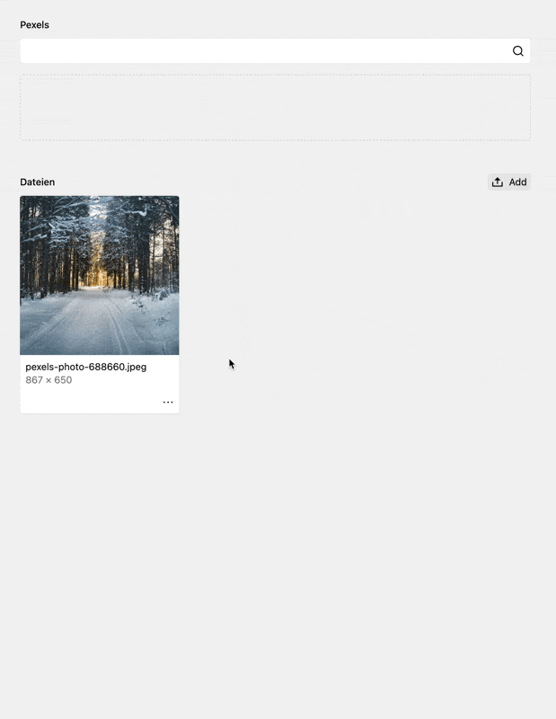

# Kirby Pexels Image Field
#### Search for Pexels photo in the panel

  

---

Add this field to directly search for photos using Pexels.com. Get a preview of the found images and download them directly to your page. Metadata will be stored automatically.

---

## Installation

Use one of these three methods to install the plugin:

- `composer require mauricerenck/pexelsimagefield`
- unzip [master.zip](https://github.com/mauricerenck/pexels-image-field/releases/latest) to `site/plugins/pexels-image-field`

* [Setup the plugin](docs/setup.md)
* [See all options](docs/options.md)

---

## Features

- Search for photos on pexel
- Download photos in the panel
- Automatically write meta data like "photographer"

---
